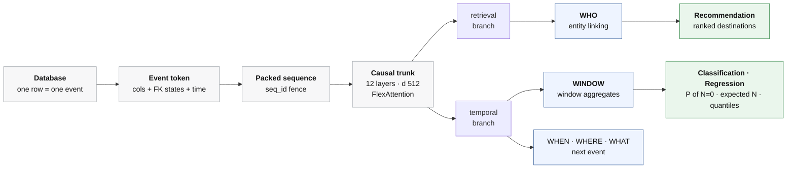

# LEDGER

**L**earned **E**vent **D**istributions for **G**eneric **E**ntity **R**eadout

**A relational database is a ledger of timestamped events.** Read it that way and
every RelBench entity task becomes one object — a window aggregate — so a single
self-supervised objective covers all of them. The task appears only at readout.
No task labels are used in training.

| Board | Metric | LEDGER | Position |
|---|---|---|---|
| Recommendation | MAP | **8.75** | **3 of 7** |
| Classification | AUROC | **72.89** | 7 of 13 |
| Regression | NMAE | **0.3391** | 8 of 14 |

31/31 tasks valid under the official scorer. Full tables: [RESULTS.md](RESULTS.md).

---

## Architecture



Shared trunk, own depth per head group; losses combined by uncertainty
weighting `Σₖ [ exp(−sₖ)·Lₖ + sₖ ]`. **The task enters at readout only.**

---

## Approach

Every RelBench entity task is a count, a sum, or a ratio of those over the events
an entity emits in `(t_q, t_q + D]`. LEDGER pretrains on the **sufficient
statistics** of that window — per-table arrival rates, per-category and
per-bucket filtered rates, and quantiles of `log1p(N)` and `log1p(Σv)` — sampling
`t_q` and `D` from pre-cutoff history. Churn is then `P(N=0)`, a count task is
`E[N]`, an LTV task is a quantile, and retrieval is the WHO head. The model never
sees a task label during training; readout is either the analytic composition
(zero-label) or a linear probe on 1,024 train rows.

Bucket edges come from pre-cutoff rows only, and `t_q + D ≤ corpus cutoff`, so a
window is never partially observed. Both are asserted in the test suite.

## Hardware

Trained on a single **NVIDIA B200 (183 GB)**, CUDA 12.8, PyTorch 2.11, Python
3.12. Models are 80M–1.25B parameters depending on database. Host RAM is the
binding constraint, not VRAM: the batcher is memory-mapped and three concurrent
`dim=512` jobs fit comfortably.

---

## Setup

```bash
git clone https://github.com/ShantanuAnant/ledger.git && cd ledger
python3.12 -m venv .venv && source .venv/bin/activate
pip install -r requirements.txt \
    --extra-index-url https://download.pytorch.org/whl/cu128 \
    --extra-index-url https://data.pyg.org/whl/torch-2.11.0+cu128.html

python -m pytest tests/ -q          # 129 passed, 3 skipped
```

## Build the corpus

Once per `(dataset, cutoff)`. Always via the cache, so concurrent jobs share one
mmapped copy. Override the location with `LEDGER_CACHE=/path`.

```bash
python -m ledger.data.cache --dataset rel-stack --split val
python -m ledger.data.cache --dataset rel-stack --split both   # val + test
```

## Smoke test

`rel-f1` is the smallest database (1.9 MB) and the one that exposes sentinel bugs.

```bash
python -m ledger.train --dataset rel-f1 --entity drivers \
    --steps 20 --workers 0 --tag smoke
```

## Train — recommendation (WHO head)

`--entity` is the task's `src_entity_table`; `--learned_tables` its
`dst_entity_table`. Name the destination explicitly.

```bash
python -m ledger.train \
    --dataset rel-stack --entity users --learned_tables posts \
    --eval_task user-post-comment \
    --who_feats --logq --hard_negs \
    --states hybrid --no_ema_write --state_center --w_when 0.1 \
    --dim 512 --layers 12 --batch_rows 16 --max_len 512 \
    --steps 60000 --eval_every 5000 --workers 24 --tag rec
```

## Train — classification / regression (WINDOW head)

```bash
python -m ledger.train \
    --dataset rel-stack --entity users --eval_entity user-badge \
    --window_head --query_feats --q_tail 0.5 --n_query 6 \
    --win_buckets 8 --win_max_events 256 \
    --self_rows --denorm_fk --child_aggs --min_hist 1 \
    --dim 512 --layers 12 --batch_rows 16 --max_len 512 \
    --steps 60000 --eval_every 500 --workers 24 --tag win
```

`--min_hist 1` when most eval rows have fewer than 2 events, else `2`.

## Evaluate

Checkpoint selection differs by family and must not be mixed: `-best.pt` is
chosen on WHO MAP, `-bestwin.pt` on the window objective.

```bash
# recommendation
PYTHONPATH=. python scripts/eval_rec.py --ckpt runs/<...>-best.pt \
    --dataset rel-stack --task user-post-comment --split test --rebuild-at-test

# classification / regression, analytic readout
PYTHONPATH=. python scripts/eval_entity.py --ckpt runs/<...>-bestwin.pt \
    --dataset rel-stack --task user-badge --split test --rebuild-at-test

# classification / regression, fitted probe
PYTHONPATH=. python scripts/icl_readout.py --ckpt runs/<...>-bestwin.pt \
    --dataset rel-stack --task user-badge --split test --support 1024
```

## Build a submission

The official scorer lives in `relbench` 3.0.1, which the training stack does not
pin (it uses 2.1.2). Install it in its own environment — it needs no torch:

```bash
python3.12 -m venv .venv-submit
.venv-submit/bin/pip install -r requirements-submit.txt

.venv-submit/bin/python scripts/make_submission.py preds_raw preds
.venv-submit/bin/python -m relbench.submit preds/ --package   # scores + zips all 3 boards
```

---

## Layout

```
ledger/model/    backbone, five heads, entity-state tables
ledger/data/     event corpus, schema, packed batcher, cache
ledger/train.py  training loop
scripts/         evaluation, readouts, board rendering, submission
tests/           leakage invariants, flex-vs-sdpa equivalence, readout algebra
```

The `scripts/*.json` files record which checkpoint produced which published
number. They name paths under `runs/` and `slim/`, which hold the trained
weights and are not distributed — so `board.py`, `board_rec.py` and
`final_board.py` are a provenance record, not runnable from a fresh clone.
Retrain with the recipes above to regenerate them.
